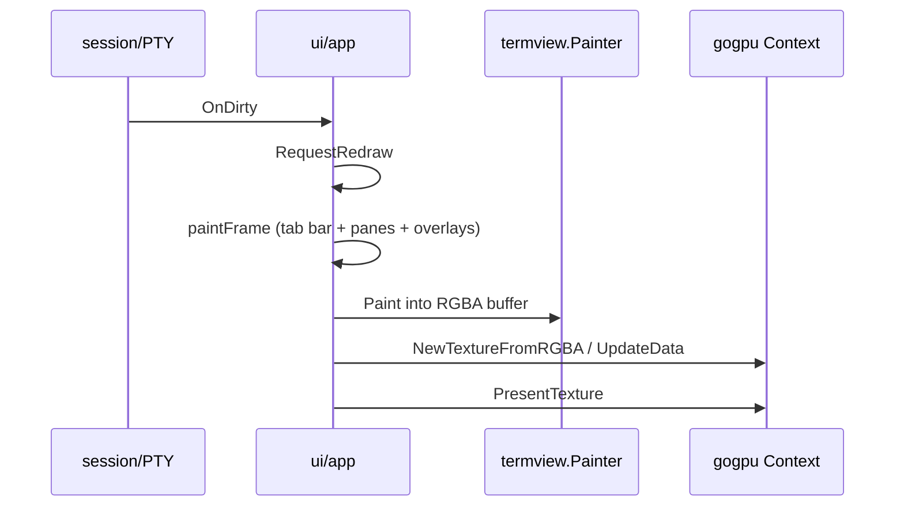

# Architecture

geckty is a GPU-accelerated terminal emulator. Domain logic (PTY, VT, sessions,
protocols) is toolkit-agnostic. The UI layer uses **gogpu** windowing; the
terminal grid and chrome are CPU-rasterized into an RGBA buffer and uploaded
as one texture per dirty frame. Retained **gogpu/ui** widgets exist for a
future present path but are not on the live hot path yet.

**Toolchain:** Go 1.27+ (`go.mod`). Small-allocation runtime improvements and
`strings.CutLast` / related stdlib helpers are available; language features
such as generic methods may be adopted where they simplify package APIs.

## Package layout

```
cmd/geckty/                 thin main: config → ui.Backend.Run; `geckty @` RC client
internal/
  config/                   TOML load, theme discovery, hot-reload
  pty/                      POSIX PTY + Windows ConPTY
  vt/ (+ emu/)              terminal state machine (vendored cy/pkg/emu)
  session/                  tabs, splits, selection, scrollback, URLs
  protocol/                 kittykbd, mouse, osc52, kittygfx, paste, focus
  plugin/                   WASM host (wazero)
  rc/                       remote-control socket protocol
  ui/
    backend.go              Backend interface
    app/                    window, input, CPU paint, PresentTexture
    termview/               Painter + fonts + TerminalWidget
    raster/                 shared CPU RGBA primitives (fills, roundrect, atlas)
    chrome/                 tab geometry/glass + TabBarWidget
    overlay/                search/hints model types
    input/                  keymap + EncodeKey/EncodeText
    theme/                  Theme = Palette + UI tokens + glass params
  protocol/                 shared Modifiers; sniffer; subpackages kittykbd/…
assets/
  fonts/mono|ui/            bundled IBM Plex Mono + PT Sans (go:embed)
  themes/*.toml             shipped themes (only builtin source)
  icon.png                  app icon
```

## Dependency rules

| Package | May import | Must not import |
|---------|------------|-----------------|
| `vt`, `pty`, `protocol` | stdlib / own deps | `ui/*`, `gogpu*` |
| `session` | `vt`, `pty`, `protocol`, `config` | `ui/*`, `gogpu*` |
| `config` | stdlib, toml, `assets` | `ui/*`, `session` |
| `rc` | stdlib | `ui/*`, `session` |
| `plugin` | wazero, toml | `ui/*`, `gogpu*` |
| `ui/theme` | `config`, `chrome` (glass math) | `gogpu/ui` widgets |
| `ui/termview` | `session`, `vt`, `theme`, gogpu/ui widget | `ui/app` |
| `ui/chrome`, `ui/overlay` | `theme`, gogpu/ui (chrome) | deep `session` internals |
| `ui/input` | `config`, `gpucontext` | `ui/app` |
| `ui/app` | UI packages + session + config + plugin + rc + gogpu | — |

## Render path



## Themes

Resolution order (Kitty/Alacritty-style):

```
embedded assets/themes/glass.toml defaults
  ← theme file (~/.config/geckty/themes/<name>.toml or embedded)
  ← inline [colors] / [ui] / [ui.glass] overrides in config.toml
```

Builtins live only as embedded TOML (`assets.Themes`). List with
`geckty --list-themes`. The repo-root [`themes/glass.toml`](../themes/glass.toml)
is a documentation/edit copy of the same file.

## Related docs

- [configuration.md](configuration.md) — user-facing config
- [roadmap.md](roadmap.md) — UX polish backlog
- [tech-debt.md](tech-debt.md) — deferred Kitty parity
