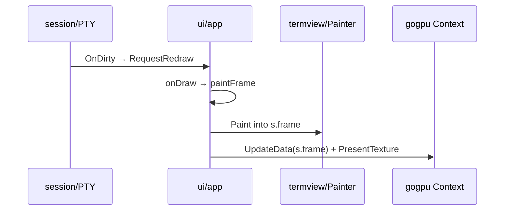
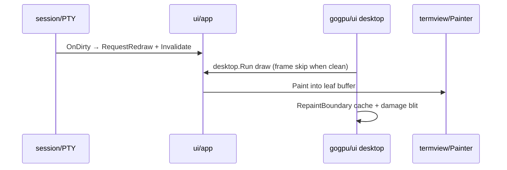

# Rendering migration: PresentTexture → gogpu/ui compositor

geckty today CPU-rasterizes the full window into `uiState.frame` and uploads it
as one GPU texture (`uploadAndPresent`). This document tracks the migration to
[gogpu/ui](https://github.com/gogpu/ui) `desktop.Run` (ADR-007): per-boundary
GPU textures, damage-aware blit, and O(1) frame skip when idle.

**Related:** [VEE #468](https://github.com/orgs/gogpu/discussions/468) (lean kernel),
upstream RFC drafts in `docs/upstream/`.

## Current path



## Target path



## Ownership

| Layer | Owner | Notes |
|-------|-------|-------|
| Compositor | `gogpu/ui/desktop` | Frame skip, boundaries, damage blit |
| Terminal grid | `termview.Painter` | VT grid, glyphs, selection, kitty gfx |
| Tab chrome | `app/tabbar.go` → later `chrome` + boundary | Glass/drag today in CPU paint |
| Input / session | `ui/app` | Unchanged — not moving into widgets yet |
| Scrollback / VT | `session`, `vt/emu` | Unchanged |

## Phases

### Phase 0 — Upstream (parallel)

- [ ] `gogpu/gogpu`: `Texture.UpdateRegion`, `GPUStats` — see `docs/upstream/gogpu-texture-subrect-rfc.md`
- [ ] `gogpu/ui`: custom raster + BYO-kit docs — see `docs/upstream/gogpu-ui-custom-raster-rfc.md`
- [ ] geckty as VEE reference app + memory baseline in catalog CI

### Phase 1 — Compositor shell (this PR)

- [x] `GECKTY_UI_COMPOSITOR=1` opt-in: `desktop.Run` + `RepaintBoundary` root
- [x] `compositorFrame` leaf calls existing `paintFrame` + `canvas.DrawImage`
- [x] Session `OnDirty` invalidates ui window + gogpu redraw
- [ ] Tests: compositor frame leaf unit test (headless canvas)

### Phase 2 — Tab bar boundary

- Wrap tab strip in its own `RepaintBoundary`
- Tab drag/hover → invalidate tab boundary only
- Remove duplicate `chrome.TabBarWidget` CPU path or unify with `tabbar.go`

### Phase 3 — Per-pane terminal boundaries

- One `termview.TerminalWidget` + `RepaintBoundary` per split leaf
- PTY dirty → invalidate that pane only
- `TakePaintDirty` → partial row paint inside leaf
- Use `Texture.UpdateRegion` when available in gogpu

### Phase 4 — Overlays as widgets

- Search / URL hints / confirm-close → overlay stack (`PushOverlay`)
- Drop inline `paint*Overlay` from monolithic frame

### Phase 5 — Remove legacy path

- Delete `s.tex`, `uploadAndPresent`, monolithic `onDraw` present path
- Default `GECKTY_UI_COMPOSITOR=1` (or remove env gate)
- CI memory regression: RSS idle + full scrollback

## Enabling compositor mode

```bash
GECKTY_UI_COMPOSITOR=1 ./geckty
```

Legacy `PresentTexture` path remains the default until Phase 5.

## Memory expectations

| Milestone | Idle RSS (macOS, rough) |
|-----------|-------------------------|
| Today (PresentTexture) | ~350–470 MB |
| After Phase 1 | Similar (infrastructure only) |
| After Phase 3 + subrect upload | ~350–400 MB |
| Terminal.app reference | ~270 MB |

wgpu baseline (~80–120 MB) is structural; full parity with Terminal.app
requires native text path (CoreText/Metal), not just compositor migration.

## Compositor vs Painter split

**Stays in Painter:** `emu` grid iteration, glyph atlas, selection, kitty
placements, font metrics, dirty row paint inside a leaf.

**Moves to compositor:** full-window RGBA buffer, `PresentTexture`, eventual
per-layer GPU cache and frame skip.
